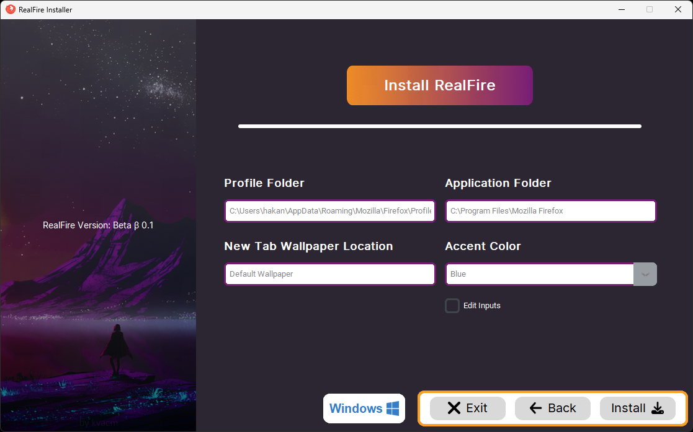
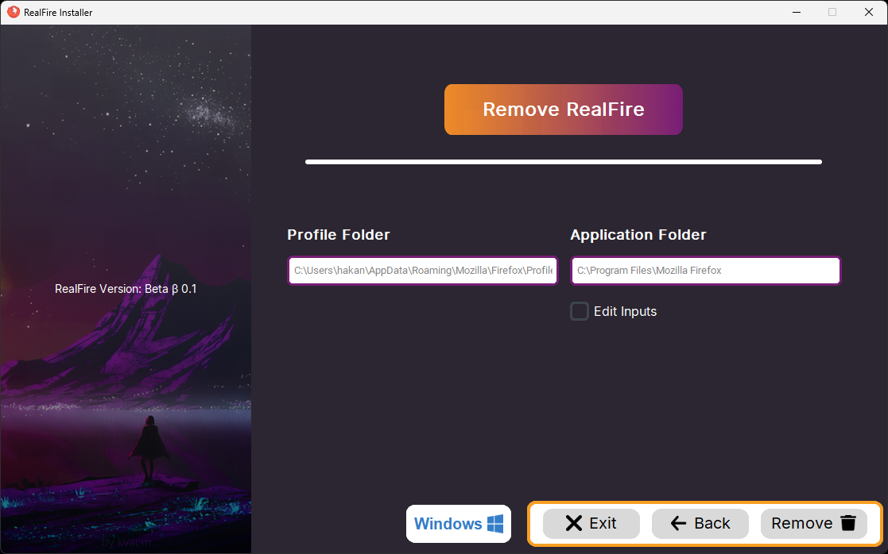
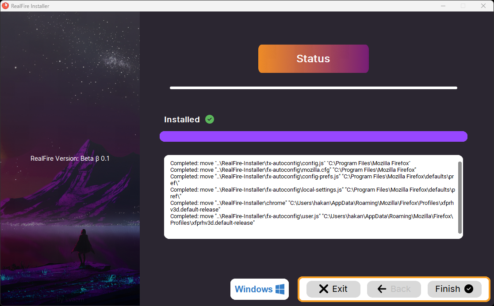

<h1 align="center">
  <br>
  <a></a>
  <br>
  RealFire Installer
  <br>
</h1>

<h4 align="center">A minimal Firefox theme installer written with <a href="https://www.python.org" target="_blank">Python</a>.</h4>

<p align="center">
  <a href="#-key-features">Key Features</a> •
  <a href="#-screenshots">Screenshots</a> •
  <a href="#-how-to-use">How To Use</a> •
  <a href="#%EF%B8%8F-build-for-testing">Build For Testing</a> •
  <a href="#-download">Download</a> •
  <a href="#-folder-structure">Folder Structure</a> •
  <a href="#-license">License</a>
</p>

## 🏞 Screenshots

<details><summary>Click me 🐈</summary>

<h3 align="center">Install Page</h3>
<p align="center" style="max-heigh:250px"></p>

<h3 align="center">Remove Page</h3>
<p align="center" style="max-heigh:250px"></p>

<h3 align="center">Status Page</h3>
<p align="center" style="max-heigh:300px"></p>

</details>

## 🔐 Key Features


* Cross platform
  - Windows, macOS and Linux ready.

## 📖 How To Use

To clone and run this application, you'll need [Git](https://git-scm.com), Python and some python libraries installed on your computer. From your command line:

```bash
# Clone this repository
$ git clone https://github.com/Hakanbaban53/RealFire-Installer

# Go into the repository
$ cd RealFire-Installer

# Install dependencies
$ pip3 install customtkinter tk pillow requests

# Run the app
$ python ./main.py
```
> **Note 1 🔩**
> If App want to admin request urn the line [here](https://github.com/Hakanbaban53/RealFire-Installer/blob/c2f6685af88cb3729435ab97fbaea4b7cbdf59a9/main.py#L19C9-L21C19) into a comment line.


> **Note 2 🔩**
> If you're using Linux Bash for Windows, [see this guide](https://www.howtogeek.com/261575/how-to-run-graphical-linux-desktop-applications-from-windows-10s-bash-shell/) or use `Python` from the command prompt.


## 🏗️ Build For Testing

To clone and run this application, you'll need [Git](https://git-scm.com), Python and some python libraries installed on your computer. From your command line:

```bash
# Clone this repository
$ git clone https://github.com/Hakanbaban53/RealFire-Installer

# Go into the repository
$ cd RealFire-Installer

# Install dependencies
$ pip3 install customtkinter tk pillow requests pyinstaller

# Build the app in Windows
$ pyinstaller --onefile .\main.py --icon=../RealFire-Installer/assets/icons/firefox.ico --add-data "../RealFire-Installer/data/installer_data.json:data" --add-data "../RealFire-Installer/assets/icons;assets/icons" --add-data "..\RealFire-Installer\assets\backgrounds;assets\backgrounds"

# Build the app in Linux
$ pyinstaller --onefile ./main.py --add-data="../RealFire-Installer/data/installer_data.json:data" --add-data="../RealFire-Installer/assets/icons:assets/icons" --add-data="../RealFire-Installer/assets/backgrounds:assets/backgrounds" --hidden-import='PIL._tkinter_finder'
```

> **Note 1 🔩**
> If you want to launch with no console add the '--noconsole' argument.

> **Note 2 🔩**
> If you encounter the externally-managed-environment error while downloading with pip3 on Linux, add the --break-system-packages argument (Warning ⚠️: this argument may cause conflicts between system packages and pip packages. If your Linux distribution has the necessary packages, please use the Linux package manager).

## ⚡ Download
You can [download](https://github.com/Hakanbaban53/RealFire-Installer/releases) the latest installable version of RealFire Installer for Windows, macOS and Linux.

## 📂 Folder structure

```css
🗃 .
│ ├── 🗎 LICENSE
│ ├── 🗎 main.py
│ └── 🗎 readme.md
│
├─── 🖿 assets
│   ├─── 🖿 backgrounds
│   │     ├── 🗎 header_title_background.png
│   │     ├── 🗎 installer_img.png
│   │     └── 🗎 line_top.png
│   │
│   ├─── 🖿 icons
│   │     ├── 🗎 attention.png
│   │     ├── 🗎 back_icon.png
│   │     ├── 🗎 block_spin.gif
│   │     ├── 🗎 check.png
│   │     └── 🗐 Many icon files
│   │
│   └─── 🖿 Preview_Images
│         ├── 🗎 home_page.png
│         ├── 🗎 install_page.png
│         ├── 🗎 remove_page.png
│         └── 🗎 status_page.png
│
├─── 🖿 data
│     ├── 🗎 installer_data.json
│     └── 🗎 installer_files_data.json
│
├─── 🖿 functions
│     ├── 🗎 detect_and_download_files.py
│     ├── 🗎 edit_file_variables.py
│     ├── 🗎 get_folder_locations.py
│     ├── 🗎 get_os_properties.py
│     ├── 🗎 install_files.py
│     └── 🗎 special_input_functions.py
│
├─── 🖿 localization
│   ├─── 🖿 EN_en
│   │   ├─── 🖿 home_page
│   │   ├─── 🖿 install_page
│   │   ├─── 🖿 modals
│   │   ├─── 🖿 remove_page
│   │   └─── 🖿 status_page
│   └─── 🖿 TR_tr
│       ├─── 🖿 home_page
│       ├─── 🖿 install_page
│       ├─── 🖿 modals
│       ├─── 🖿 remove_page
│       └─── 🖿 status_page
├─── 🖿 modals
│     ├── 🗎 check_files_modal.py
│     └── 🗎 combined_modal.py
│
└─── 🖿 pages
      ├── 🗎 home_page.py
      ├── 🗎install_page.py
      ├── 🗎 remove_page.py
      └── 🗎 status_page.py
```

## 🔑 License

MIT

---

