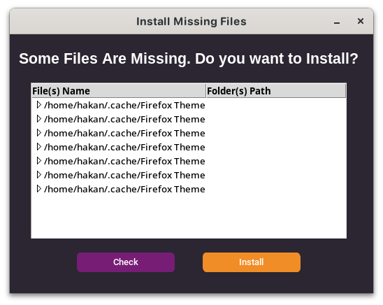

<h1 align="center">
  <br>
  <a></a>
  <br>
  Firefox Theme Installer
  <br>
</h1>

<h4 align="center">A minimal Firefox theme installer written with <a href="https://www.python.org" target="_blank">Python</a>.</h4>

<p align="center">
  <a href="#-key-features">Key Features</a> •
  <a href="#-screenshots">Screenshots</a> •
  <a href="#%EF%B8%8F-build-for-testing">Build For Testing</a> •
  <a href="#-download">Download</a> •
  <a href="#-folder-structure">Folder Structure</a> •
  <a href="#-license">License</a>
</p>

## 🏞 Screenshots

<details><summary>Pages</summary>

<h3 align="center">Install Page</h3>
<p align="center" style="max-heigh:250px"></p>

<h3 align="center">Remove Page</h3>
<p align="center" style="max-heigh:250px"></p>

<h3 align="center">Status Page</h3>
<p align="center" style="max-heigh:300px"></p>

</details>

<details><summary>Modals</summary>

<h3 align="center">Themes Modal</h3>
<p align="center" style="max-heigh:150px"></p>

<h3 align="center">Theme Detail</h3>
<p align="center" style="max-heigh:150px"></p>

<h3 align="center">Json Theme Handler</h3>
<p align="center" style="max-heigh:150px"></p>

<h3 align="center">Info Modals</h3>
<p align="center" style="max-heigh:150px"></p>

</details>

## 🔐 Key Features

* Cross platform
* Custom theme support
* Theme preview before installation
* Custom script loader support

## 🏗️ Build For Testing

To clone and run this application, you'll need [Git](https://git-scm.com), Python and some python libraries installed on your computer. From your command line:

```bash
# Clone this repository
$ git clone https://github.com/Hakanbaban53/Firefox-Theme-Installer

# Go into the repository
$ cd Firefox-Theme-Installer

# Install dependencies
$ pip3 install customtkinter tk pillow requests pyinstaller

# Build the app in Windows
$ pyinstaller --onefile .\main.py --icon=../Firefox-Theme-Installer/assets/icons/firefox.ico --add-data "..\Firefox-Theme-Installer\assets:assets" --add-data "..\Firefox-Theme-Installer\language:language" --add-data "..\Firefox-Theme-Installer\data\local:data\local"

# Build the app in Linux
$ pyinstaller --onefile ./main.py --hidden-import='PIL._tkinter_finder' --add-data="../Firefox-Theme-Installer/assets:assets" --add-data="../Firefox-Theme-Installer/language:language" --add-data="../Firefox-Theme-Installer/data/local:data/local"
```

> **Note 1 🔩**
> If you want to launch with no console add the '--noconsole' argument.

> **Note 2 🔩**
> If you encounter the externally-managed-environment error while downloading with pip3 on Linux, add the `--break-system-packages` argument (Warning ⚠️: this argument may cause conflicts between system packages and pip packages. If your Linux distribution has the necessary packages, please use the Linux package manager).

## ⚡ Download
You can [download](https://github.com/Hakanbaban53/Firefox-Theme-Installer/releases) the latest installable version of Firefox Theme Installer for Windows, macOS and Linux.

## 📂 Folder structure

```css
.
├── assets
│   ├── block_spin.gif
│   ├── firefox.ico
│   └── Other icon data in png format
├── components
│   ├── create_detect_installed_theme.py
│   ├── create_header.py
│   ├── create_inputs_and_checkboxes.py
│   ├── create_navigation_button.py
│   └── set_window_icon.py
├── data
│   ├── local
│   │   └── Local data using for app build
│   └── online
│       └── Online data for fetching internet
├── installer_core
│   ├── cli_tools
│   │   ├── argument_parser.py
│   │   └── cli_app.py
│   ├── component_tools
│   │   ├── preview_theme.py
│   │   ├── special_input_functions.py
│   │   └── thread_manager.py
│   ├── data_tools
│   │   ├── get_folder_locations.py
│   │   ├── get_os_properties.py
│   │   ├── get_theme_data.py
│   │   ├── image_loader.py
│   │   ├── language_manager.py
│   │   └── load_json_data.py
│   ├── file_utils
│   │   ├── detect_and_download_files.py
│   │   ├── file_actions.py
│   │   └── get_the_theme_files.py
│   └── window_tools
│       └── center_window.py
├── language
│   ├── app
│   │   └── Main app language in json format
│   ├── components
│   │   └── Components language data in json format
│   ├── modals
│   │   └── Modal language data in json format
│   └── pages
│       └── Page language data in json format
├── LICENSE
├── main.py
├── modals
│   ├── check_files_modal.py
│   ├── info_modals.py
│   ├── theme_detail_modal.py
│   └── theme_modal.py
├── pages
│   ├── home_page.py
│   ├── install_page.py
│   ├── remove_page.py
│   └── status_page.py
├── assets
│   └── assets png format
└── readme.md
```

## 🔑 License

MIT

---

<h1 align="center"> Hakan İSMAİL ❤️‍🔥 </h1>