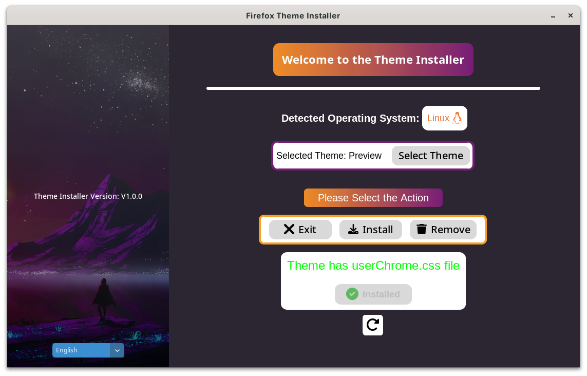
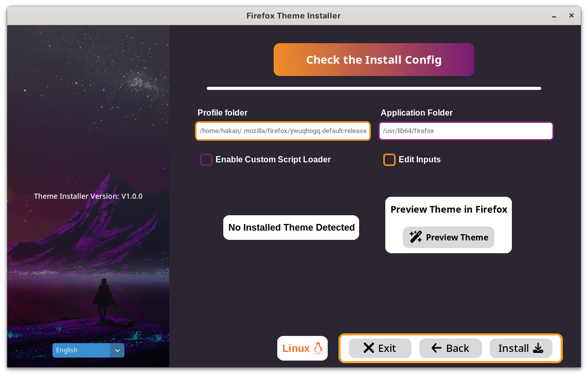
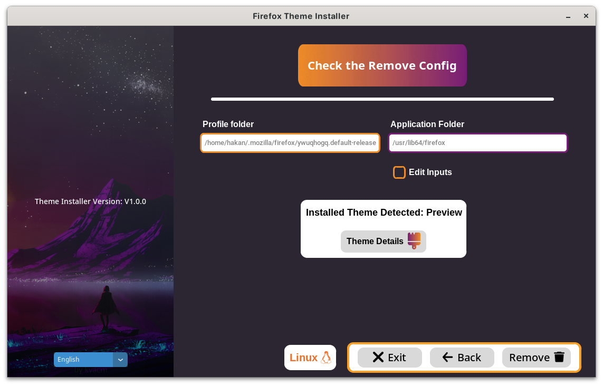
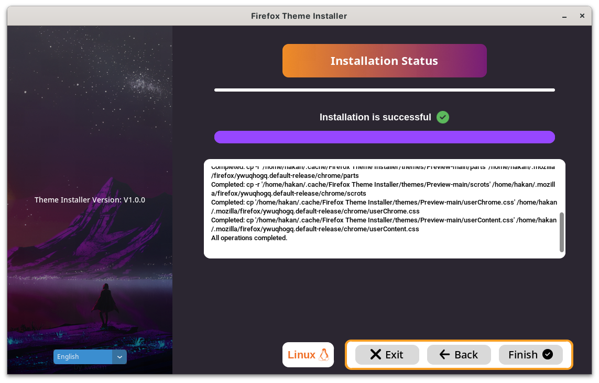
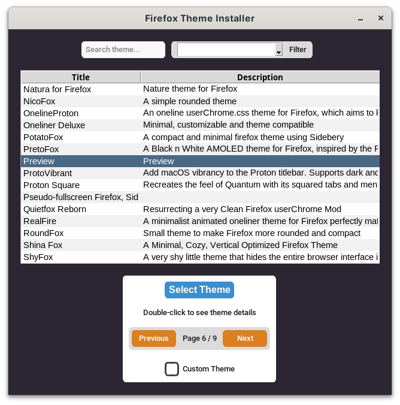
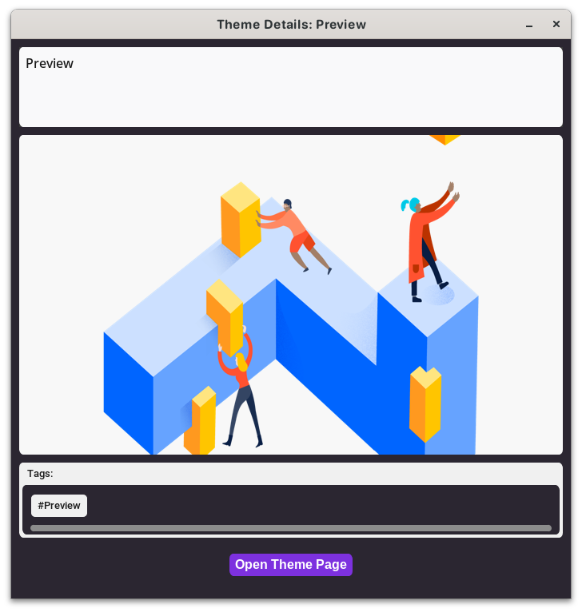
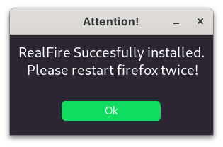
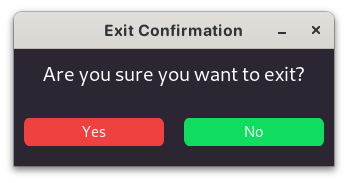

<h1 align="center">
  <br>
  <a></a>
  <br>
  Firefox Theme Installer
  <br>
</h1>

<h4 align="center">A minimal Firefox theme installer written with <a href="https://www.python.org" target="_blank">Python</a>.</h4>

<p align="center">
  <a href="#-key-features">Key Features</a> •
  <a href="#-screenshots">Screenshots</a> •
  <a href="#%EF%B8%8F-build-for-testing">Build For Testing</a> •
  <a href="#-download">Download</a> •
  <a href="#-folder-structure">Folder Structure</a> •
  <a href="#-license">License</a>
</p>

## 🏞 Screenshots

<details><summary>Pages</summary>

<h3 align="center">Install Page</h3>
<p align="center" style="max-heigh:250px"></p>

<h3 align="center">Remove Page</h3>
<p align="center" style="max-heigh:250px"></p>

<h3 align="center">Status Page</h3>
<p align="center" style="max-heigh:300px"></p>

</details>

<details><summary>Modals</summary>

<h3 align="center">Themes Modal</h3>
<p align="center" style="max-heigh:150px"></p>

<h3 align="center">Theme Detail</h3>
<p align="center" style="max-heigh:150px"></p>

<h3 align="center">Info Modals</h3>
<p align="center" style="max-heigh:150px"></p>

</details>

## 🔐 Key Features

* Cross platform
* Custom theme support
* Theme preview before installation
* Custom script loader support

## ⚡ Download
You can [download](https://github.com/Hakanbaban53/Firefox-Theme-Installer/releases) the latest installable version of Firefox Theme Installer for Windows and Linux (I add the MacOS path but I didn't test it because I don't have a MacOS device).

## ❓ How Its Work 

When you install a Firefox theme, the app checks for the presence of `userChrome.css` or `userContent.css` files. If either of these files is found, the app will copy all associated files and directories from the location of the `userChrome.css` or `userContent.css` file. If neither file is found, the app will return an error message: `No theme data or userChrome.css found`.

All themes installing with the app are stored in the `themes` directory. This folder under the cache directory. If you want to remove a theme, you can do it from the app or manually delete the theme folder from the `themes` directory. Here is the [directory](src/data/static/os_properties.py) of the cache directory.

## 🏗️ Test and Build

To test and build the app, check the [test](docs/test.md) guide.

## 🚀 Issues

If you encounter any issues or have suggestions for improvements, please feel free to open an issue on our [GitHub Issues page](https://github.com/Hakanbaban53/Firefox-Theme-Installer/issues). We welcome contributions and feedback from the community to make this project better.

### ❓ How to Report an Issue

1. **Search Existing Issues**: Before opening a new issue, please check if the issue has already been reported.
2. **Create a New Issue**: If your issue is not listed, create a new issue and provide detailed information.
  - **Title**: A clear and descriptive title.
  - **Description**: A detailed description of the issue, including steps to reproduce, expected behavior, and actual behavior.
  - **Screenshots**: If applicable, include screenshots to help illustrate the issue.
  - **Environment**: Specify the environment in which the issue occurs (e.g., OS, Python version, etc.).

### 🌟 Feature Requests

We also welcome feature requests! If you have an idea for a new feature or an improvement, please open an issue and label it as a feature request. Provide as much detail as possible to help us understand your suggestion.

Thank you for helping us improve Firefox Theme Installer!

## 🌟 Contributions

We welcome contributions from the community to help improve Firefox Theme Installer. If you would like to contribute, please follow these steps:

1. **Fork the Repository**: Click the "Fork" button in the upper right corner of the repository.
2. **Clone the Repository**: Clone the forked repository to your local machine.
3. **Create a New Branch**: Create a new branch for your contribution.
4. **Make Changes**: Make your changes to the codebase. If you are adding a new language check the [adding a new language](docs/language.md) guide.
5. **Commit Changes**: Commit your changes with a descriptive commit message.
6. **Push Changes**: Push your changes to your forked repository.
7. **Create a Pull Request**: Create a pull request to the main repository with your changes.


## 📂 Folder structure

```css
🗃
├── 🗎 readme.md
├── 🗎 LICENSE
├── 🖿 assets
│   └── 🖻 Preview images
└── 🖿 src
    ├── ⚙️ app.py
    ├── 🖿 assets
    │   ├── 🖻 block_spinner.gif
    │   ├── 🖻 firefox.ico
    │   └── 🖻 Other assets
    ├── 🖿 core
    │   ├── 🖿 component_tools
    │   │   ├── 🗎 preview_theme.py
    │   │   ├── 🗎 special_input_functions.py
    │   │   └── 🗎 thread_manager.py
    │   ├── 🖿 data_tools
    │   │   ├── 🗎 get_folder_locations.py
    │   │   ├── 🗎 get_os_properties.py
    │   │   ├── 🗎 get_theme_data.py
    │   │   ├── 🗎 image_loader.py
    │   │   ├── 🗎 language_manager.py
    │   │   └── 🗎 load_json_data.py
    │   ├── 🖿 file_utils
    │   │   ├── 🗎 detect_and_download_files.py
    │   │   ├── 🗎 file_actions.py
    │   │   └── 🗎 get_the_theme_files.py
    │   └── 🖿 window_tools
    │       └── 🗎 center_window.py
    ├── 🖿 data
    │   ├── 🖿 language
    │   │   └── 🗎 Language Data Files (json)
    │   ├── 🖿 online
    │   │   └── 🗎 fx-autoconfig.json
    │   └── 🖿 static
    │       ├── 🖿 components
    │       │   ├── 🖿 inputs_and_checkboxes
    │       │   │   └── 🗎 data.py
    │       │   └── 🖿 navigation_buttons
    │       │       └── 🗎 data.py
    │       ├── 🗎 global_data.py
    │       └── 🗎 os_properties.py
    └── 🖿 UI
        ├── 🖿 components
        │   ├── 🗎 create_detect_installed_theme.py
        │   ├── 🗎 create_header.py
        │   ├── 🗎 create_inputs_and_checkboxes.py
        │   ├── 🗎 create_navigation_button.py
        │   └── 🗎 set_window_icon.py
        ├── 🖿 modals
        │   ├── 🗎 info_modals.py
        │   ├── 🗎 theme_detail_modal.py
        │   └── 🗎 theme_modal.py
        └── 🖿 pages
            ├── 🗎 home_page.py
            ├── 🗎 install_page.py
            ├── 🗎 remove_page.py
            └── 🗎 status_page.py
```

## 🔑 License

Firefox Theme Installer is licensed under the [MIT License](LICENSE).

---

<h1 align="center"> Hakan İSMAİL ❤️‍🔥 </h1>